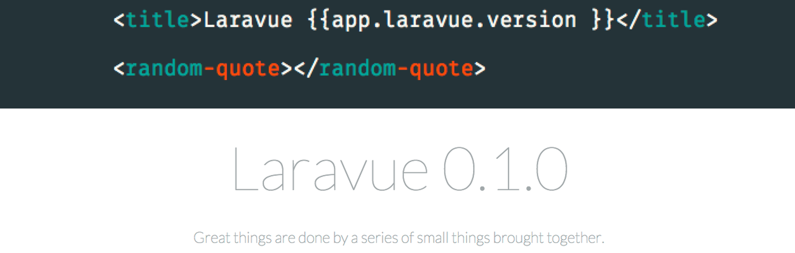

## Laravue - a sensible starting point for single-page apps


Laravue is a fork of the Laravel framework. It includes the vue js
framework for the front end, and contains much of the boilerplate
required for using it.

## Installing

1. Clone the repository.
2. CD into the repo.
3. Run `npm install`. This installs all of Vue's dependencies.
4. Run `composer install`. This installs all of Laravel's dependencies.
5. Run `mv .env.example .env`. This enables your env files to set your app into local mode.
6. Run `php artisan key:generate`. This generates a secure cipher key for encrypting your data.
7. Run `php artisan serve`. This serves your application to the browser. You can also use Homestead, LAMP, WAMP, etc.
8. In a new tab/window, run `npm run watch` in the same directory. This compiles your Vue resources, and automaticly runs whenever you save a file! You can also use `nmp run build` to do a one-time build of your javascript assets.
9. *Hack something great!*

## Roadmap

Wondering what the plans are for Laravue? Check out this list to see where we're going with it!

- JWT Tokens
- Vanilla Version
- Authentication API
- Better documentation site
- Lumen build for lightweight sites
- CLI for building views and components
- Composer tool to create new projects using `laravue new project`
- Composer `create-project` tool for an alternative way of starting off.
- Custom Elixir plugin to make this possible instead of npm scripts. `mix.laravue('app.js')`.
- Automated syncing with main Laravel repo. Right now I manually sync the fork then push to Github.
- Async callback anonymous function for call method, basically "OK thing happened here's what I do now that it's done."

## Usage
Laravue gives you a few things that may not sound like much, but are really the foundations of any app you may build:

1. a standard way to communicate from app -> view
2. a standard way to communicate from view -> app
3. a standard way to communicate from components -> view
4. a standard way to communicate from components -> app

Why would we want these features? Suppose we want to change the currentView from within a view. Right now, there’s no easy way to do that. Using my setup, we can just run `@app.laravue.view ‘awesome’` .

Another example is if you want to have one user object served up from the backend that can be accessed application-wide. Just add it to the data object of your main app and it can be accessed from views using `@app.user` !

For more about this implementation of front-end architecture, check out [this post in Laravel News](https://medium.com/laravel-news/advanced-front-end-setup-with-vue-js-laravel-e9fbd7e89fe2)

### Methods (on `laravue` object)
#### `view(name)`
This method changes the view component's `currentView` to the argument you passed it. The function will automatically add `-view` to the end of the name you pass it. If you're using coffeescript, like I suggest, you can just run `@app.laravue.view 'about'` and it will take you to the about page. If not, just run `this.app.laravue.view('about');`.

#### `call(view, method, args...)`
This method calls a method on another view, regardless of whether or not it's already loaded. If it is loaded, Laravue goes ahead and calls it. If not, we wait for the view to be loaded, then run the function. The first argument is the name of the view that you want to have a method called on. The second one is the name of the method you want run. Any arguments after that are passed into the method as arguments using javascript magic closures! To use it, go `@app.laravue.call('contacts', 'load')`. If you want to pass arguments, just go `@app.laravue.call('contacts', 'load', 'russweas@gmail.com')`. The third paramater, my email, will be passed into the `load()` method on the contacs-view component. For example, you might have:
```
module.exports =
  methods:
    load: (email) ->
      console.log email
  ready: () -> require '../view-ready.coffee'.call this # required for laravue to work
  props: ['app'] # if you want to use @app from within the view
```
#### `goToAnd(view, name, args...)`
`goToAnd()` is just a shorter way of running `call()` then `view()`. Really useful for most use case scenarios!

### Creating a new element component
First, create a new file in the `resources/assets/js/components` directory called `my-component.coffee`. Put all functionality in an object which you set to `module.exports`. If you want HTML for this element, create a `my-component.template.html` in the same directory. In the object your created in the `.coffee`, add a `template` key, and set it equal to a `require` statement to the template file. Also, in case you're wondering, shadow DOM is not enabled, but it shouldn't be too hard to set up (no promises). Then, go to the file `components.coffee`. Duplicate the latest line underneath components and rename it to suite your file you just created. The key you give it will be what you instantiate it with in html, i.e. if it's `my-component` you use `<my-component>` in HTML. The value should be a require statement pointing to the file. That's it, that easily can now start using your own element anywhere in your app!

### Creating a new view component
To create a new view component, first create a file in `resources/assets/js/views` called `about.coffee`, replacing about with the name you want your view to have. Paste the following code into it:
```
module.exports =
    ready: () -> require '../view-ready.coffee'.call this
    props: ['app']
```
Go into `components.coffee` and duplicate the last line under views. Replace the relevant fields with links to your new view. Be sure to keep the `-view` at the end of the key! This differentiates your view from stand-alone elements. Next, go into your `app.js` and add the name of your view to the `init` method called on the `laravue` instance. Your view should now be up and working! To test it out, go into `laravue.coffee` and on line 3, change the name of `currentView` to be your new view, again, keep the `-view`. To test it out, just go into a browser and refresh!

If you have any questions just open an issue or contact me on twitter @russweas and I'll be glad to help!
## Official Documentation

Documentation for the framework can be found on the [Laravue website](http://laravue.github.io/docs).

## Contributing

Contributing is easy! Just open a Pull Request and tell me why I should accept it.

## Security Vulnerabilities

If you discover a vulnerability in Laravue itself, contact me at russweas@gmail.com and open an issue.

If you discover a security vulnerability within Laravel, please send an e-mail to Taylor Otwell at taylor@laravel.com. All security vulnerabilities will be promptly addressed.

### License

The Laravue framework is open-sourced software licensed under the [MIT license](http://opensource.org/licenses/MIT).
Credit to Taylor Otwell for the creation of Laravel and Evan You for the creation of Vue JS!
