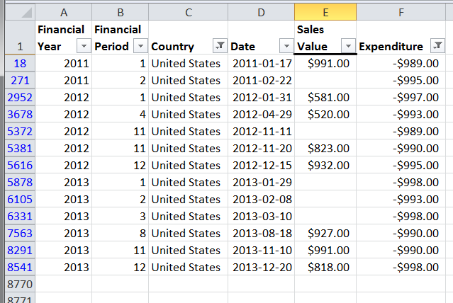
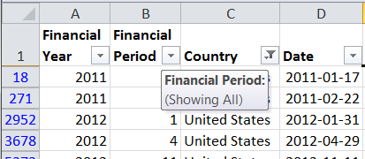
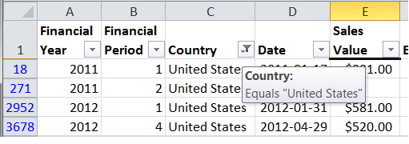

# PHPExcel AutoFilter Reference 

## AutoFilters

Each worksheet in an Excel Workbook can contain a single autoFilter range. Filtered data displays only the rows that meet criteria that you specify and hides rows that you do not want displayed. You can filter by more than one column: filters are additive, which means that each additional filter is based on the current filter and further reduces the subset of data.

When an AutoFilter is applied to a range of cells, the first row in an autofilter range will be the heading row, which displays the autoFilter dropdown icons. It is not part of the actual autoFiltered data. All subsequent rows are the autoFiltered data. So an AutoFilter range should always contain the heading row and one or more data rows (one data row is pretty meaningless), but PHPExcel won't actually stop you specifying a meaningless range: it's up to you as the developer to avoid such errors.

To determine if a filter is applied, note the icon in the column heading. A drop-down arrow () means that filtering is enabled but not applied. In MS Excel, when you hover over the heading of a column with filtering enabled but not applied, a screen tip displays the cell text for the first row in that column, and the message "(Showing All)".

A Filter button () means that a filter is applied. When you hover over the heading of a filtered column, a screen tip displays the filter that has been applied to that column, such as "Equals a red cell color" or "Larger than 150".

