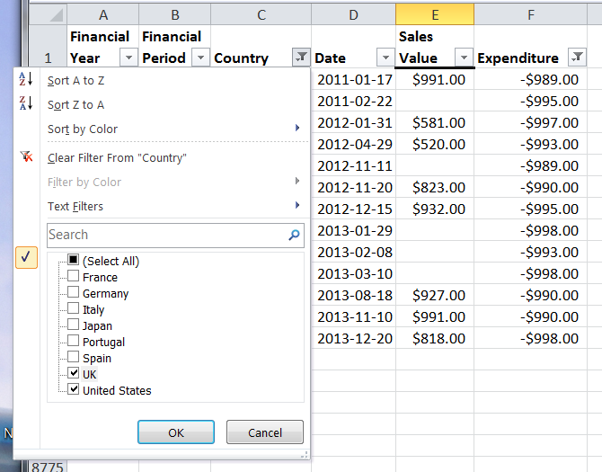

# PHPExcel AutoFilter Reference 


## Autofilter Expressions

### Simple filters

In MS Excel, Simple Filters are a dropdown list of all values used in that column, and the user can select which ones they want to display and which ones they want to hide by ticking and unticking the checkboxes alongside each option. When the filter is applied, rows containing the checked entries will be displayed, rows that don't contain those values will be hidden.



To create a filter expression, we need to start by identifying the filter type. In this case, we're just going to specify that this filter is a standard filter.

```php
$columnFilter->setFilterType(
    PHPExcel_Worksheet_AutoFilter_Column::AUTOFILTER_FILTERTYPE_FILTER
);
```

Now we've identified the filter type, we can create a filter rule and set the filter values:

When creating a simple filter in PHPExcel, you only need to specify the values for "checked" columns: you do this by creating a filter rule for each value.

```php
$columnFilter->createRule()
    ->setRule(
        PHPExcel_Worksheet_AutoFilter_Column_Rule::AUTOFILTER_COLUMN_RULE_EQUAL,
        'France'
    );

$columnFilter->createRule()
    ->setRule(
        PHPExcel_Worksheet_AutoFilter_Column_Rule::AUTOFILTER_COLUMN_RULE_EQUAL,
        'Germany'
    );
```

This creates two filter rules: the column will be filtered by values that match “France” OR “Germany”. For Simple Filters, you can create as many rules as you want

Simple filters are always a comparison match of EQUALS, and multiple standard filters are always treated as being joined by an OR condition.

#### Matching Blanks

If you want to create a filter to select blank cells, you would use:

```php
$columnFilter->createRule()
    ->setRule(
        PHPExcel_Worksheet_AutoFilter_Column_Rule::AUTOFILTER_COLUMN_RULE_EQUAL,
        ''
    );
```
