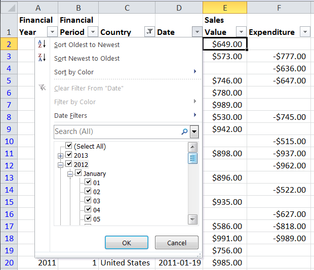

# PHPExcel AutoFilter Reference 


## Autofilter Expressions

### DateGroup Filters

In MS Excel, DateGroup filters provide a series of dropdown filter selectors for date values, so you can specify entire years, or months within a year, or individual days within each month.



DateGroup filters are still applied as a Standard Filter type.

```php
$columnFilter->setFilterType(
    PHPExcel_Worksheet_AutoFilter_Column::AUTOFILTER_FILTERTYPE_FILTER
);
```

Creating a dateGroup filter in PHPExcel, you specify the values for "checked" columns as an associative array of year. month, day, hour minute and second. To select a year and month, you need to create a DateGroup rule identifying the selected year and month:

```php
$columnFilter->createRule()
    ->setRule(
        PHPExcel_Worksheet_AutoFilter_Column_Rule::AUTOFILTER_COLUMN_RULE_EQUAL,
        array(
            'year' => 2012,
            'month' => 1
        )
    )
    ->setRuleType(
        PHPExcel_Worksheet_AutoFilter_Column_Rule::AUTOFILTER_RULETYPE_DATEGROUP
    );
```

The key values for the associative array are:

 - year
 - month
 - day
 - hour
 - minute
 - second

Like Standard filters, DateGroup filters are always a match of EQUALS, and multiple standard filters are always treated as being joined by an OR condition.

Note that we alse specify a ruleType: to differentiate this from a standard filter, we explicitly set the Rule's Type to AUTOFILTER_RULETYPE_DATEGROUP. As with standard filters, we can create any number  of DateGroup Filters.

