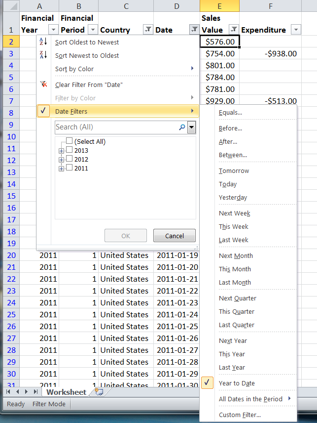

# PHPExcel AutoFilter Reference 


## Autofilter Expressions

### Dynamic Filters

Dynamic Filters are based on a dynamic comparison condition, where the value we're comparing against the cell values is variable, such as 'today'; or when we're testing against an aggregate of the cell data (e.g. 'aboveAverage'). Only a single dynamic filter can be applied to a column at a time.



Again, we start by specifying a Filter type, this time a DYNAMICFILTER.

```php
$columnFilter->setFilterType(
    PHPExcel_Worksheet_AutoFilter_Column::AUTOFILTER_FILTERTYPE_DYNAMICFILTER
);
```

When defining the rule for a dynamic filter, we don't define a value (we can simply set that to NULL) but we do specify the dynamic filter category.

```php
$columnFilter->createRule()
    ->setRule(
        PHPExcel_Worksheet_AutoFilter_Column_Rule::AUTOFILTER_COLUMN_RULE_EQUAL,
        NULL,
        PHPExcel_Worksheet_AutoFilter_Column_Rule::AUTOFILTER_RULETYPE_DYNAMIC_YEARTODATE
    )
    ->setRuleType(
        PHPExcel_Worksheet_AutoFilter_Column_Rule::AUTOFILTER_RULETYPE_DYNAMICFILTER
    );
```

We also set the rule type to DYNAMICFILTER.

The valid set of dynamic filter categories is defined in the PHPExcel_Worksheet_AutoFilter_Column_Rule class, and comprises:

    Operator Constant                        | Value          |
    -----------------------------------------|----------------|
    AUTOFILTER_RULETYPE_DYNAMIC_YESTERDAY    | 'yesterday'    |
    AUTOFILTER_RULETYPE_DYNAMIC_TODAY        | 'today'        |
    AUTOFILTER_RULETYPE_DYNAMIC_TOMORROW     | 'tomorrow'     |
    AUTOFILTER_RULETYPE_DYNAMIC_YEARTODATE   | 'yearToDate'   |
    AUTOFILTER_RULETYPE_DYNAMIC_THISYEAR     | 'thisYear'     |
    AUTOFILTER_RULETYPE_DYNAMIC_THISQUARTER  | 'thisQuarter'  |
    AUTOFILTER_RULETYPE_DYNAMIC_THISMONTH    | 'thisMonth'    |
    AUTOFILTER_RULETYPE_DYNAMIC_THISWEEK     | 'thisWeek'     |
    AUTOFILTER_RULETYPE_DYNAMIC_LASTYEAR     | 'lastYear'     |
    AUTOFILTER_RULETYPE_DYNAMIC_LASTQUARTER  | 'lastQuarter'  |
    AUTOFILTER_RULETYPE_DYNAMIC_LASTMONTH    | 'lastMonth'    |
    AUTOFILTER_RULETYPE_DYNAMIC_LASTWEEK     | 'lastWeek'     |
    AUTOFILTER_RULETYPE_DYNAMIC_NEXTYEAR     | 'nextYear'     |
    AUTOFILTER_RULETYPE_DYNAMIC_NEXTQUARTER  | 'nextQuarter'  |
    AUTOFILTER_RULETYPE_DYNAMIC_NEXTMONTH    | 'nextMonth'    |
    AUTOFILTER_RULETYPE_DYNAMIC_NEXTWEEK     | 'nextWeek'     |
    AUTOFILTER_RULETYPE_DYNAMIC_MONTH_1      | 'M1'           |
    AUTOFILTER_RULETYPE_DYNAMIC_JANUARY      | 'M1'           |
    AUTOFILTER_RULETYPE_DYNAMIC_MONTH_2      | 'M2'           |
    AUTOFILTER_RULETYPE_DYNAMIC_FEBRUARY     | 'M2'           |
    AUTOFILTER_RULETYPE_DYNAMIC_MONTH_3      | 'M3'           |
    AUTOFILTER_RULETYPE_DYNAMIC_MARCH        | 'M3'           |
    AUTOFILTER_RULETYPE_DYNAMIC_MONTH_4      | 'M4'           |
    AUTOFILTER_RULETYPE_DYNAMIC_APRIL        | 'M4'           |
    AUTOFILTER_RULETYPE_DYNAMIC_MONTH_5      | 'M5'           |
    AUTOFILTER_RULETYPE_DYNAMIC_MAY          | 'M5'           |
    AUTOFILTER_RULETYPE_DYNAMIC_MONTH_6      | 'M6'           |
    AUTOFILTER_RULETYPE_DYNAMIC_JUNE         | 'M6'           |
    AUTOFILTER_RULETYPE_DYNAMIC_MONTH_7      | 'M7'           |
    AUTOFILTER_RULETYPE_DYNAMIC_JULY         | 'M7'           |
    AUTOFILTER_RULETYPE_DYNAMIC_MONTH_8      | 'M8'           |
    AUTOFILTER_RULETYPE_DYNAMIC_AUGUST       | 'M8'           |
    AUTOFILTER_RULETYPE_DYNAMIC_MONTH_9      | 'M9'           |
    AUTOFILTER_RULETYPE_DYNAMIC_SEPTEMBER    | 'M9'           |
    AUTOFILTER_RULETYPE_DYNAMIC_MONTH_10     | 'M10'          |
    AUTOFILTER_RULETYPE_DYNAMIC_OCTOBER      | 'M10'          |
    AUTOFILTER_RULETYPE_DYNAMIC_MONTH_11     | 'M11'          |
    AUTOFILTER_RULETYPE_DYNAMIC_NOVEMBER     | 'M11'          |
    AUTOFILTER_RULETYPE_DYNAMIC_MONTH_12     | 'M12'          |
    AUTOFILTER_RULETYPE_DYNAMIC_DECEMBER     | 'M12'          |
    AUTOFILTER_RULETYPE_DYNAMIC_QUARTER_1    | 'Q1'           |
    AUTOFILTER_RULETYPE_DYNAMIC_QUARTER_2    | 'Q2'           |
    AUTOFILTER_RULETYPE_DYNAMIC_QUARTER_3    | 'Q3'           |
    AUTOFILTER_RULETYPE_DYNAMIC_QUARTER_4    | 'Q4'           |
    AUTOFILTER_RULETYPE_DYNAMIC_ABOVEAVERAGE | 'aboveAverage' |
    AUTOFILTER_RULETYPE_DYNAMIC_BELOWAVERAGE | 'belowAverage' |

We can only apply a single Dynamic Filter rule to a column at a time.

