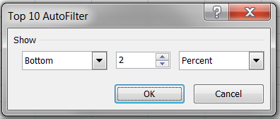

# PHPExcel AutoFilter Reference 


## Autofilter Expressions

### Top Ten Filters

Top Ten Filters are similar to Dynamic Filters in that they are based on a summarisation of the actual data values in the cells. However, unlike Dynamic Filters where you can only select a single option, Top Ten Filters allow you to select based on a number of criteria:




You can identify whether you want the top (highest) or bottom (lowest) values.You can identify how many values you wish to select in the filterYou can identify whether this should be a percentage or a number of items.

Like Dynamic Filters, only a single Top Ten filter can be applied to a column at a time.

We start by specifying a Filter type, this time a DYNAMICFILTER.

```php
$columnFilter->setFilterType(
    PHPExcel_Worksheet_AutoFilter_Column::AUTOFILTER_FILTERTYPE_TOPTENFILTER
);
```

Then we create the rule:

```php
$columnFilter->createRule()
    ->setRule(
        PHPExcel_Worksheet_AutoFilter_Column_Rule::AUTOFILTER_COLUMN_RULE_TOPTEN_PERCENT,
        5,
        PHPExcel_Worksheet_AutoFilter_Column_Rule::AUTOFILTER_COLUMN_RULE_TOPTEN_TOP
    )
    ->setRuleType(
        PHPExcel_Worksheet_AutoFilter_Column_Rule::AUTOFILTER_RULETYPE_TOPTENFILTER
    );
```

This will filter the Top 5 percent of values in the column.

To specify the lowest (bottom 2 values), we would specify a rule of:

```php
$columnFilter->createRule()
    ->setRule(
        PHPExcel_Worksheet_AutoFilter_Column_Rule::AUTOFILTER_COLUMN_RULE_TOPTEN_BY_VALUE,
        5,
        PHPExcel_Worksheet_AutoFilter_Column_Rule::AUTOFILTER_COLUMN_RULE_TOPTEN_BOTTOM
    )
    ->setRuleType(
        PHPExcel_Worksheet_AutoFilter_Column_Rule::AUTOFILTER_RULETYPE_TOPTENFILTER
    );
```

The option values for TopTen Filters top/bottom value/percent are all defined in the PHPExcel_Worksheet_AutoFilter_Column_Rule class, and comprise:

    Operator Constant                      | Value       |
    ---------------------------------------|-------------|
    AUTOFILTER_COLUMN_RULE_TOPTEN_BY_VALUE | 'byValue'   |
    AUTOFILTER_COLUMN_RULE_TOPTEN_PERCENT  | 'byPercent' |

and

    Operator Constant                    | Value    |
    -------------------------------------|----------|
    AUTOFILTER_COLUMN_RULE_TOPTEN_TOP    | 'top'    |
    AUTOFILTER_COLUMN_RULE_TOPTEN_BOTTOM | 'bottom' |

