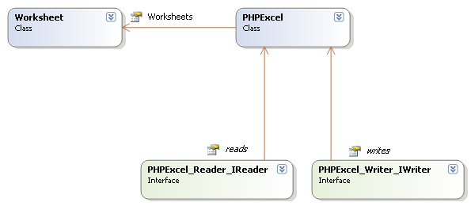
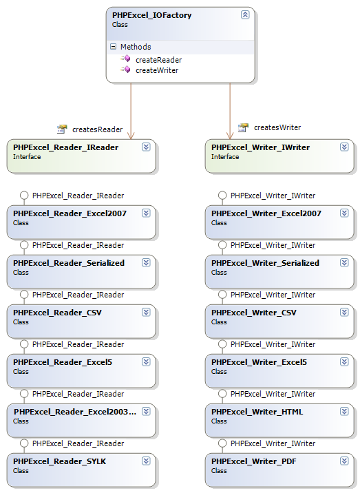

# PHPExcel Developer Documentation


## Architecture

### Schematical




### Lazy Loader

PHPExcel implements an autoloader or "lazy loader", which means that it is not necessary to include every file within PHPExcel. It is only necessary to include the initial PHPExcel class file, then the autoloader will include other class files as and when required, so only those files that are actually required by your script will be loaded into PHP memory. The main benefit of this is that it reduces the memory footprint of PHPExcel itself, so that it uses less PHP memory.

If your own scripts already define an autoload function, then this may be overwritten by the PHPExcel autoload function. For example, if you have:
```php
function __autoload($class) {
    ...
}
```
Do this instead:
```php
function myAutoload($class) {
    ...
}

spl_autoload_register('myAutoload');
```
Your autoloader will then co-exist with the autoloader of PHPExcel.


### Spreadsheet in memory

PHPExcel's architecture is built in a way that it can serve as an in-memory spreadsheet. This means that, if one would want to create a web based view of a spreadsheet which communicates with PHPExcel's object model, he would only have to write the front-end code.

Just like desktop spreadsheet software, PHPExcel represents a spreadsheet containing one or more worksheets, which contain cells with data, formulas, images, ...


### Readers and writers

On its own, PHPExcel does not provide the functionality to read from or write to a persisted spreadsheet (on disk or in a database). To provide that functionality, readers and writers can be used.

By default, the PHPExcel package provides some readers and writers, including one for the Open XML spreadsheet format (a.k.a. Excel 2007 file format). You are not limited to the default readers and writers, as you are free to implement the PHPExcel_Reader_IReader and PHPExcel_Writer_IWriter interface in a custom class.



### Fluent interfaces

PHPExcel supports fluent interfaces in most locations. This means that you can easily "chain" calls to specific methods without requiring a new PHP statement. For example, take the following code:

```php
$objPHPExcel->getProperties()->setCreator("Maarten Balliauw");
$objPHPExcel->getProperties()->setLastModifiedBy("Maarten Balliauw");
$objPHPExcel->getProperties()->setTitle("Office 2007 XLSX Test Document");
$objPHPExcel->getProperties()->setSubject("Office 2007 XLSX Test Document");
$objPHPExcel->getProperties()->setDescription("Test document for Office 2007 XLSX, generated using PHP classes.");
$objPHPExcel->getProperties()->setKeywords("office 2007 openxml php");
$objPHPExcel->getProperties()->setCategory("Test result file");
```

This can be rewritten as:

```php
$objPHPExcel->getProperties()
    ->setCreator("Maarten Balliauw")
    ->setLastModifiedBy("Maarten Balliauw")
    ->setTitle("Office 2007 XLSX Test Document")
    ->setSubject("Office 2007 XLSX Test Document")
    ->setDescription("Test document for Office 2007 XLSX, generated using PHP classes.")
    ->setKeywords("office 2007 openxml php")
    ->setCategory("Test result file");
```

 > __Using fluent interfaces is not required__  
 > Fluent interfaces have been implemented to provide a convenient programming API. Use of them is not required, but can make your code easier to read and maintain.  
 > It can also improve performance, as you are reducing the overall number of calls to PHPExcel methods: in the above example, the `getProperties()` method is being called only once rather than 7 times in the non-fluent version.
