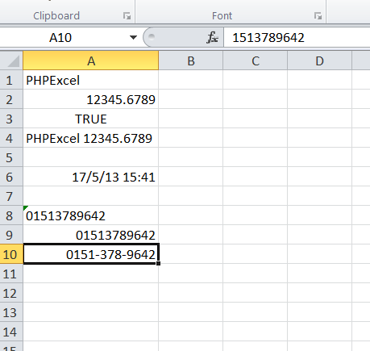
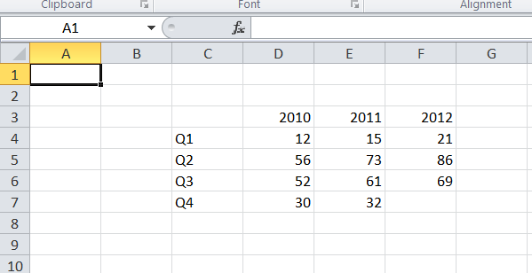
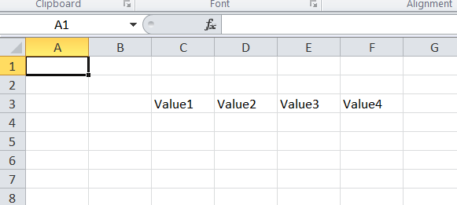
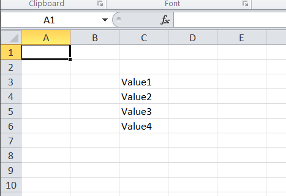

# PHPExcel Developer Documentation

## Accessing cells

Accessing cells in a PHPExcel worksheet should be pretty straightforward. This topic lists some of the options to access a cell.

### Setting a cell value by coordinate

Setting a cell value by coordinate can be done using the worksheet's `setCellValue()` method.

```php
// Set cell A1 with a string value
$objPHPExcel->getActiveSheet()->setCellValue('A1', 'PHPExcel');

// Set cell A2 with a numeric value
$objPHPExcel->getActiveSheet()->setCellValue('A2', 12345.6789);

// Set cell A3 with a boolean value
$objPHPExcel->getActiveSheet()->setCellValue('A3', TRUE);

// Set cell A4 with a formula
$objPHPExcel->getActiveSheet()->setCellValue(
    'A4', 
    '=IF(A3, CONCATENATE(A1, " ", A2), CONCATENATE(A2, " ", A1))'
);
```

Alternatively, you can retrieve the cell object, and then call the cell’s setValue() method:

```php
$objPHPExcel->getActiveSheet()
    ->getCell('B8')
    ->setValue('Some value');
```

**Excel DataTypes**

MS Excel supports 7 basic datatypes
 - string
 - number
 - boolean
 - null
 - formula
 - error
 - Inline (or rich text) string

By default, when you call the worksheet's `setCellValue()` method or the cell's `setValue()` method, PHPExcel will use the appropriate datatype for PHP nulls, booleans, floats or integers; or cast any string data value that you pass to the method into the most appropriate datatype, so numeric strings will be cast to numbers, while string values beginning with “=” will be converted to a formula. Strings that aren't numeric, or that don't begin with a leading "=" will be treated as genuine string values.

This "conversion" is handled by a cell "value binder", and you can write custom "value binders" to change the behaviour of these "conversions". The standard PHPExcel package also provides an "advanced value binder" that handles a number of more complex conversions, such as converting strings with a fractional format like "3/4" to a number value (0.75 in this case) and setting an appropriate "fraction" number format mask. Similarly, strings like "5%" will be converted to a value of 0.05, and a percentage number format mask applied, and strings containing values that look like dates will be converted to Excel serialized datetimestamp values, and a corresponding mask applied. This is particularly useful when loading data from csv files, or setting cell values from a database.

Formats handled by the advanced value binder include
 - TRUE or FALSE (dependent on locale settings) are converted to booleans.
 - Numeric strings identified as scientific (exponential) format are converted to numbers.
 - Fractions and vulgar fractions are converted to numbers, and an appropriate number format mask applied.
 - Percentages are converted to numbers, divided by 100, and an appropriate number format mask applied.
 - Dates and times are converted to Excel timestamp values (numbers), and an appropriate number format mask applied.
 - When strings contain a newline character ("\n"), then the cell styling is set to wrap.

You can read more about value binders later in this section of the documentation.

#### Setting a date and/or time value in a cell

Date or time values are held as timestamp in Excel (a simple floating point value), and a number format mask is used to show how that value should be formatted; so if we want to store a date in a cell, we need to calculate the correct Excel timestamp, and set a number format mask.

```php
// Get the current date/time and convert to an Excel date/time
$dateTimeNow = time();
$excelDateValue = PHPExcel_Shared_Date::PHPToExcel( $dateTimeNow );
// Set cell A6 with the Excel date/time value
$objPHPExcel->getActiveSheet()->setCellValue(
    'A6', 
    $excelDateValue
);
// Set the number format mask so that the excel timestamp will be displayed as a human-readable date/time
$objPHPExcel->getActiveSheet()->getStyle('A6')
    ->getNumberFormat()
    ->setFormatCode(
        PHPExcel_Style_NumberFormat::FORMAT_DATE_DATETIME
    );
```

#### Setting a number with leading zeroes

By default, PHPExcel will automatically detect the value type and set it to the appropriate Excel numeric datatype. This type conversion is handled by a value binder, as described in the section of this document entitled "Using value binders to facilitate data entry".

Numbers don't have leading zeroes, so if you try to set a numeric value that does have leading zeroes (such as a telephone number) then these will be normally be lost as the value is cast to a number, so "01513789642" will be displayed as 1513789642.

There are two ways you can force PHPExcel to override this behaviour.

Firstly, you can set the datatype explicitly as a string so that it is not converted to a number.

```php
// Set cell A8 with a numeric value, but tell PHPExcel it should be treated as a string
$objPHPExcel->getActiveSheet()->setCellValueExplicit(
    'A8', 
    "01513789642",
    PHPExcel_Cell_DataType::TYPE_STRING
);
```

Alternatively, you can use a number format mask to display the value with leading zeroes.

```php
// Set cell A9 with a numeric value
$objPHPExcel->getActiveSheet()->setCellValue('A9', 1513789642);
// Set a number format mask to display the value as 11 digits with leading zeroes
$objPHPExcel->getActiveSheet()->getStyle('A9')
    ->getNumberFormat()
    ->setFormatCode(
        '00000000000'
    );
```

With number format masking, you can even break up the digits into groups to make the value more easily readable.

```php
// Set cell A10 with a numeric value
$objPHPExcel->getActiveSheet()->setCellValue('A10', 1513789642);
// Set a number format mask to display the value as 11 digits with leading zeroes
$objPHPExcel->getActiveSheet()->getStyle('A10')
    ->getNumberFormat()
    ->setFormatCode(
        '0000-000-0000'
    );
```




**Note** that not all complex format masks such as this one will work when retrieving a formatted value to display "on screen", or for certain writers such as HTML or PDF, but it will work with the true spreadsheet writers (Excel2007 and Excel5).

### Setting a range of cells from an array

It is also possible to set a range of cell values in a single call by passing an array of values to the `fromArray()` method.

```php
$arrayData = array(
    array(NULL, 2010, 2011, 2012),
    array('Q1',   12,   15,   21),
    array('Q2',   56,   73,   86),
    array('Q3',   52,   61,   69),
    array('Q4',   30,   32,    0),
);
$objPHPExcel->getActiveSheet()
    ->fromArray(
        $arrayData,  // The data to set
        NULL,        // Array values with this value will not be set
        'C3'         // Top left coordinate of the worksheet range where
                     //    we want to set these values (default is A1)
    );
```



If you pass a 2-d array, then this will be treated as a series of rows and columns. A 1-d array will be treated as a single row, which is particularly useful if you're fetching an array of data from a database.

```php
$rowArray = array('Value1', 'Value2', 'Value3', 'Value4');
$objPHPExcel->getActiveSheet()
    ->fromArray(
        $rowArray,   // The data to set
        NULL,        // Array values with this value will not be set
        'C3'         // Top left coordinate of the worksheet range where
                     //    we want to set these values (default is A1)
    );
```



If you have a simple 1-d array, and want to write it as a column, then the following will convert it into an appropriately structured 2-d array that can be fed to the `fromArray()` method:

```php
$rowArray = array('Value1', 'Value2', 'Value3', 'Value4');
$columnArray = array_chunk($rowArray, 1);
$objPHPExcel->getActiveSheet()
    ->fromArray(
        $columnArray,   // The data to set
        NULL,           // Array values with this value will not be set
        'C3'            // Top left coordinate of the worksheet range where
                        //    we want to set these values (default is A1)
    );
```



### Retrieving a cell value by coordinate

To retrieve the value of a cell, the cell should first be retrieved from the worksheet using the `getCell()` method. A cell's value can be read using the `getValue()` method.

```php
// Get the value fom cell A1
$cellValue = $objPHPExcel->getActiveSheet()->getCell('A1')
    ->getValue();
```

This will retrieve the raw, unformatted value contained in the cell.

If a cell contains a formula, and you need to retrieve the calculated value rather than the formula itself, then use the cell's `getCalculatedValue()` method. This is further explained in .

```php
// Get the value fom cell A4
$cellValue = $objPHPExcel->getActiveSheet()->getCell('A4')
    ->getCalculatedValue();
```

Alternatively, if you want to see the value with any cell formatting applied (e.g. for a human-readable date or time value), then you can use the cell's `getFormattedValue()` method.

```php
// Get the value fom cell A6
$cellValue = $objPHPExcel->getActiveSheet()->getCell('A6')
    ->getFormattedValue();
```


### Setting a cell value by column and row

Setting a cell value by coordinate can be done using the worksheet's `setCellValueByColumnAndRow()` method.

```php
// Set cell B5 with a string value
$objPHPExcel->getActiveSheet()->setCellValueByColumnAndRow(1, 5, 'PHPExcel');
```

**Note** that column references start with '0' for column 'A', rather than from '1'.

### Retrieving a cell value by column and row

To retrieve the value of a cell, the cell should first be retrieved from the worksheet using the getCellByColumnAndRow method. A cell’s value can be read again using the following line of code:

```php
// Get the value fom cell B5
$cellValue = $objPHPExcel->getActiveSheet()->getCellByColumnAndRow(1, 5)
    ->getValue();
```
If you need the calculated value of a cell, use the following code. This is further explained in .

```php
// Get the value fom cell A4
$cellValue = $objPHPExcel->getActiveSheet()->getCellByColumnAndRow(0, 4)
    ->getCalculatedValue();
```

### Retrieving a range of cell values to an array

It is also possible to retrieve a range of cell values to an array in a single call using the `toArray()`, `rangeToArray()` or `namedRangeToArray()` methods.

```php
$dataArray = $objPHPExcel->getActiveSheet()
    ->rangeToArray(
        'C3:E5',     // The worksheet range that we want to retrieve
        NULL,        // Value that should be returned for empty cells
        TRUE,        // Should formulas be calculated (the equivalent of getCalculatedValue() for each cell)
        TRUE,        // Should values be formatted (the equivalent of getFormattedValue() for each cell)
        TRUE         // Should the array be indexed by cell row and cell column
    );
```

These methods will all return a 2-d array of rows and columns. The `toArray()` method will return the whole worksheet; `rangeToArray()` will return a specified range or cells; while `namedRangeToArray()` will return the cells within a defined `named range`.

### Looping through cells

#### Looping through cells using iterators

The easiest way to loop cells is by using iterators. Using iterators, one can use foreach to loop worksheets, rows within a worksheet, and cells within a row.

Below is an example where we read all the values in a worksheet and display them in a table.

```php
$objReader = PHPExcel_IOFactory::createReader('Excel2007');
$objReader->setReadDataOnly(TRUE);
$objPHPExcel = $objReader->load("test.xlsx");

$objWorksheet = $objPHPExcel->getActiveSheet();

echo '<table>' . PHP_EOL;
foreach ($objWorksheet->getRowIterator() as $row) {
    echo '<tr>' . PHP_EOL;
    $cellIterator = $row->getCellIterator();
    $cellIterator->setIterateOnlyExistingCells(FALSE); // This loops through all cells,
                                                       //    even if a cell value is not set.
                                                       // By default, only cells that have a value 
                                                       //    set will be iterated.
    foreach ($cellIterator as $cell) {
        echo '<td>' . 
             $cell->getValue() . 
             '</td>' . PHP_EOL;
    }
    echo '</tr>' . PHP_EOL;
}
echo '</table>' . PHP_EOL;
```

Note that we have set the cell iterator's `setIterateOnlyExistingCells()` to FALSE. This makes the iterator loop all cells within the worksheet range, even if they have not been set.

The cell iterator will return a __NULL__ as the cell value if it is not set in the worksheet.
Setting the cell iterator's setIterateOnlyExistingCells() to FALSE will loop all cells in the worksheet that can be available at that moment. This will create new cells if required and increase memory usage! Only use it if it is intended to loop all cells that are possibly available.

#### Looping through cells using indexes

One can use the possibility to access cell values by column and row index like (0,1) instead of 'A1' for reading and writing cell values in loops.

Note: In PHPExcel column index is 0-based while row index is 1-based. That means 'A1' ~ (0,1)

Below is an example where we read all the values in a worksheet and display them in a table.

```php
$objReader = PHPExcel_IOFactory::createReader('Excel2007');
$objReader->setReadDataOnly(TRUE);
$objPHPExcel = $objReader->load("test.xlsx");

$objWorksheet = $objPHPExcel->getActiveSheet();
// Get the highest row and column numbers referenced in the worksheet
$highestRow = $objWorksheet->getHighestRow(); // e.g. 10
$highestColumn = $objWorksheet->getHighestColumn(); // e.g 'F'
$highestColumnIndex = PHPExcel_Cell::columnIndexFromString($highestColumn); // e.g. 5

echo '<table>' . "\n";
for ($row = 1; $row <= $highestRow; ++$row) {
    echo '<tr>' . PHP_EOL;
    for ($col = 0; $col <= $highestColumnIndex; ++$col) {
        echo '<td>' . 
             $objWorksheet->getCellByColumnAndRow($col, $row)
                 ->getValue() . 
             '</td>' . PHP_EOL;
    }
    echo '</tr>' . PHP_EOL;
}
echo '</table>' . PHP_EOL;
```

Alternatively, you can take advantage of PHP's "Perl-style" character incrementors to loop through the cells by coordinate:

```php
$objReader = PHPExcel_IOFactory::createReader('Excel2007');
$objReader->setReadDataOnly(TRUE);
$objPHPExcel = $objReader->load("test.xlsx");

$objWorksheet = $objPHPExcel->getActiveSheet();
// Get the highest row number and column letter referenced in the worksheet
$highestRow = $objWorksheet->getHighestRow(); // e.g. 10
$highestColumn = $objWorksheet->getHighestColumn(); // e.g 'F'
// Increment the highest column letter
$highestColumn++;

echo '<table>' . "\n";
for ($row = 1; $row <= $highestRow; ++$row) {
    echo '<tr>' . PHP_EOL;
    for ($col = 'A'; $col != $highestColumn; ++$col) {
        echo '<td>' . 
             $objWorksheet->getCell($col . $row)
                 ->getValue() . 
             '</td>' . PHP_EOL;
    }
    echo '</tr>' . PHP_EOL;
}
echo '</table>' . PHP_EOL;
```

Note that we can't use a <= comparison here, because 'AA' would match as <= 'B', so we increment the highest column letter and then loop while $col != the incremented highest column.

### Using value binders to facilitate data entry

Internally, PHPExcel uses a default PHPExcel_Cell_IValueBinder implementation (PHPExcel_Cell_DefaultValueBinder) to determine data types of entered data using a cell's `setValue()` method (the `setValueExplicit()` method bypasses this check).

Optionally, the default behaviour of PHPExcel can be modified, allowing easier data entry. For example, a PHPExcel_Cell_AdvancedValueBinder class is available. It automatically converts percentages, number in scientific format, and dates entered as strings to the correct format, also setting the cell's style information. The following example demonstrates how to set the value binder in PHPExcel:

```php
/** PHPExcel */
require_once 'PHPExcel.php';

// Set value binder
PHPExcel_Cell::setValueBinder( new PHPExcel_Cell_AdvancedValueBinder() );

// Create new PHPExcel object
$objPHPExcel = new PHPExcel();

// ...
// Add some data, resembling some different data types
$objPHPExcel->getActiveSheet()->setCellValue('A4', 'Percentage value:');
// Converts the string value to 0.1 and sets percentage cell style
$objPHPExcel->getActiveSheet()->setCellValue('B4', '10%');

$objPHPExcel->getActiveSheet()->setCellValue('A5', 'Date/time value:');
// Converts the string value to an Excel datestamp and sets the date format cell style
$objPHPExcel->getActiveSheet()->setCellValue('B5', '21 December 1983');  
```

__Creating your own value binder is easy.__  
When advanced value binding is required, you can implement the PHPExcel_Cell_IValueBinder interface or extend the PHPExcel_Cell_DefaultValueBinder or PHPExcel_Cell_AdvancedValueBinder classes.

