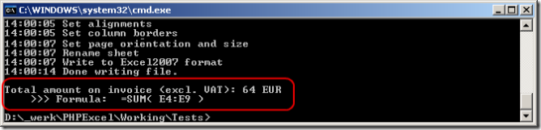
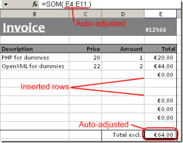

# PHPExcel Developer Documentation

## Using the PHPExcel calculation engine

### Performing formula calculations

As PHPExcel represents an in-memory spreadsheet, it also offers formula calculation capabilities. A cell can be of a value type (containing a number or text), or a formula type (containing a formula which can be evaluated). For example, the formula "=SUM(A1:A10)" evaluates to the sum of values in A1, A2, ..., A10.

To calculate a formula, you can call the cell containing the formula’s method getCalculatedValue(), for example:

```php
$objPHPExcel->getActiveSheet()->getCell('E11')->getCalculatedValue();
```
If you write the following line of code in the invoice demo included with PHPExcel, it evaluates to the value "64":



Another nice feature of PHPExcel's formula parser, is that it can automatically adjust a formula when inserting/removing rows/columns. Here's an example:


You see that the formula contained in cell E11 is "SUM(E4:E9)". Now, when I write the following line of code, two new product lines are added:

```php
$objPHPExcel->getActiveSheet()->insertNewRowBefore(7, 2);
```



Did you notice? The formula in the former cell E11 (now E13, as I inserted 2 new rows), changed to "SUM(E4:E11)". Also, the inserted cells duplicate style information of the previous cell, just like Excel's behaviour. Note that you can both insert rows and columns.

### Known limitations

There are some known limitations to the PHPExcel calculation engine. Most of them are due to the fact that an Excel formula is converted into PHP code before being executed. This means that Excel formula calculation is subject to PHP's language characteristics.

#### Operator precedence

In Excel '+' wins over '&', just like '*' wins over '+' in ordinary algebra. The former rule is not what one finds using the calculation engine shipped with PHPExcel.

Reference for operator precedence in Excel: [http://support.microsoft.com/kb/25189][18]

Reference for operator precedence in PHP: [http://www.php.net/operators][19]

#### Formulas involving numbers and text

Formulas involving numbers and text may produce unexpected results or even unreadable file contents. For example, the formula '=3+"Hello "' is expected to produce an error in Excel (#VALUE!). Due to the fact that PHP converts “Hello” to a numeric value (zero), the result of this formula is evaluated as 3 instead of evaluating as an error. This also causes the Excel document being generated as containing unreadable content.

Reference for this behaviour in PHP: [http://be.php.net/manual/en/language.types.string.php#language.types.string.conversion][20]

  [18]: http://support.microsoft.com/kb/25189
  [19]: http://www.php.net/operators
  [20]: http://be.php.net/manual/en/language.types.string.php#language.types.string.conversion
